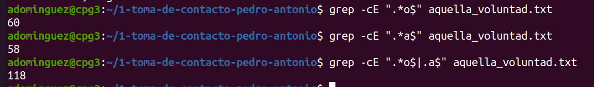
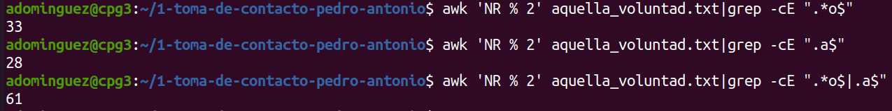
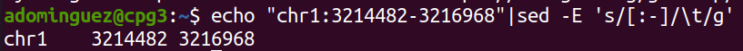
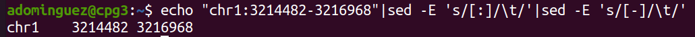

# Sesión IV - Expresiones regulares: grep, sed y awk

Herramientas computacionales para bioinformática: UNIX, expresiones regulares y shell script

Edita esta plantilla en formato markdown [Guía aquí](https://guides.github.com/features/mastering-markdown/) como se pide en el guión. 
Cuando hayas acabado, haz un commit de tus cambios y súbelos al repositorio antes de la fecha de entrega señalada. 

======================================

**Añade por favor capturas de pantalla y el código de tus pipelines.**

## Ejercicio 1
Usando el fichero `aquella_voluntad.txt`, identifica usando grep:

1. El número de líneas que terminan por `o`. 

En primer lugar para obtener el resultado del número de líneas acabadas en "o" con grep, hacemos uso de las expresiones regulares de la siguiente manera: 
`grep -cE ".*o$" aquella_voluntad.txt`
El resultado de líneas que nos salen que acaban por "o" son 60. 

2. El número de líneas que terminan por `o` o por `a`. 
Ya tenemos del ejercicio anterior cuatas líneas terminan por "o", para saber las que terminan por "a" usaremos este comando: 
`grep -cE ".*a$" aquella_voluntad.txt`
Podríamos sumar las líneas que acaban por "a" y las que acaban por "b" y obtener el resultado, pero también lo podemos hacer directamente con el siguiente comando: 
`grep -cE ".*o$|.a$" aquella_voluntad.txt`

3. El número de líneas pares que terminan por `o` o por `a`

Para calcular el número de lineas pares, empezando por la primera línea como si fuese la línea 0 usaremos el comando `awk 'NR % 2' aquella_voluntad.txt`

Tras esto haremos un pipe con grep, que será:

`awk 'NR % 2' aquella_voluntad.txt|grep -cE ".*o$|.a$"`

4. Todas las palabras que empiezan y acaban por `s` (ordenadas alfabéticamente)

5. Todas las palabras que no empiezan por `t` y acaban por `s`. (ordenadas por número de línea)

6. Todas las palabras que empiezan y acaban por la misma letra (volver a este punto al acabar toda la lección). 

### Respuesta ejercicio 1

## Ejercicio 2
¿Cuántos gene_ids existen con varios ceros seguidos en los dos gtfs (Humano y Drosophila)?. ¿Cuáles son? ¿Cuántas veces aparece cada uno en el .gtf dado?
Explora el fichero de anotaciones para ver si existen otros gene_ids con muchos números seguidos iguales.

### Respuesta ejercicio 2

## Ejercicio 3

Crea un pipeline que convierta un fichero fasta con secuencias partidas en múltiples líneas en otro sin saltos de línea. 
Al final, para cada secuencia, imprimirá su nombre y el número de caracteres que tenga. 

### Respuesta ejercicio 3

## Ejercicio 4
En la sección 3.1., convertimos la cadena `chr1:3214482-3216968` a un formato tabular con `sed`. Sin embargo, existen otras maneras en las que podríamos haber obtenido el mismo resultado final. ¿Se te ocurren algunas? Recuerda que puedes usar el flag `g`, o puedes encadenar distintas llamadas a `sed` con tuberías si ves que meterlo todo en una única expresión regular se te antoja complicado. 

### Respuesta ejercicio 4
Para hacer este ejercicio empleando el flag `g` de `sed` lo podríamos hacer de la siguiente forma: 
`echo "chr1:3214482-3216968"|sed -E 's/[:-]/\t/g'`
Con este pipe en primer lugar lo que estamos haciendo es con echo mostrar a la salida estándar el texto que hemos introducido, y en la segunda parte del pipe con sed lo que hacemos es que nos sustituya `s` los `:` y `-` por un tabulador `\t` . Finalmente tenemos que emplear el flag `g` ya que si no solo nos hará el cambio de la primera ocurrencia `:` por el tabulador `\t` , pero no de la segunda ocurrencia `-`.

Si lo queremos hacer en un pipe con distintas llamadas a sed lo haríamos así:

`echo "chr1:3214482-3216968"|sed -E 's/[:]/\t/'|sed -E 's/[-]/\t/'`

