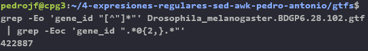

# Sesión IV - Expresiones regulares: grep, sed y awk

Herramientas computacionales para bioinformática: UNIX, expresiones regulares y shell script

Edita esta plantilla en formato markdown [Guía aquí](https://guides.github.com/features/mastering-markdown/) como se pide en el guión. 
Cuando hayas acabado, haz un commit de tus cambios y súbelos al repositorio antes de la fecha de entrega señalada. 

======================================

**Añade por favor capturas de pantalla y el código de tus pipelines.**

## Ejercicio 1
Usando el fichero `aquella_voluntad.txt`, identifica usando grep:

1. El número de líneas que terminan por `o`. 

En primer lugar para obtener el resultado del número de líneas acabadas en "o" con grep, hacemos uso de las expresiones regulares de la siguiente manera: 
`grep -cE ".*o$" aquella_voluntad.txt`
El resultado de líneas que nos salen que acaban por "o" son 60. 

2. El número de líneas que terminan por `o` o por `a`. 
Ya tenemos del ejercicio anterior cuatas líneas terminan por "o", para saber las que terminan por "a" usaremos este comando: 
`grep -cE ".*a$" aquella_voluntad.txt`
Podríamos sumar las líneas que acaban por "a" y las que acaban por "b" y obtener el resultado, pero también lo podemos hacer directamente con el siguiente comando: 
`grep -cE ".*o$|.a$" aquella_voluntad.txt`

3. El número de líneas pares que terminan por `o` o por `a`

Para calcular el número de lineas pares, empezando por la primera línea como si fuese la línea 0 usaremos el comando `awk 'NR % 2' aquella_voluntad.txt`

Tras esto haremos un pipe con grep, que será:

`awk 'NR % 2' aquella_voluntad.txt|grep -cE ".*o$|.a$"`

4. Todas las palabras que empiezan y acaban por `s` (ordenadas alfabéticamente)

Para encontrar todas las palasbras que empiecen y acaben por `s` empleando el comando grep, empleamos el siguiente comando: 

`grep -Eio '\bs\w*s\b' aquella_voluntad.txt|sort`

Ahora vamos a explicar este comando: 
- El flag `-E`(extended) indica a `grep`que use  ERE (Expresiones Regulares Extendidas). 
- El flag `-i` para una búsqueda case-insensitive, lo que quiere decir que buscará tanto mayúsculas como minúsculas. 
- El flag `-o` para que imprima por pantalla las líneas coincidentes, palabras que coinciden con la expresión regular que hemos puesto. 

Con este comando le decimos a grep que busque aquellas palabras que empiecen por "s" y que vayan segidas de caracteres de tipo palabra (letras, dígitos, o guión bajo) y finalmente que acaben por "s". La b indicaría u  separador de palabras "espacio". 

5. Todas las palabras que no empiezan por `t` y acaban por `s`. (ordenadas por número de línea)

`grep -Eio "[^(t)]a\w+s" aquella_voluntad.txt -n|sort -n`

grep -Eion '\b[^t]\w*s\b' aquella_voluntad.txt |sort -n

6. Todas las palabras que empiezan y acaban por la misma letra (volver a este punto al acabar toda la lección). 

### Respuesta ejercicio 1

## Ejercicio 2
¿Cuántos gene_ids existen con varios ceros seguidos en los dos gtfs (Humano y Drosophila)?. ¿Cuáles son? ¿Cuántas veces aparece cada uno en el .gtf dado?
Explora el fichero de anotaciones para ver si existen otros gene_ids con muchos números seguidos iguales.

### Respuesta ejercicio 2

En el caso del gtf de Drosophila, para comprobar cuántos gene_id con dos o más ceros seguidos existen hemos introducido el siguiente pipeline: `grep -Eo 'gene_id "[^"]*"' Drosophila_melanogaster.BDGP6.28.102.gtf | grep -Eoc 'gene_id ".*0{2,}.*"'`, en primer lugar indicamos a grep que envíe a la stdout solamente la parte del archivo que coincida con el patrón especificado entre '', esto se consigue con la opción -o, después le indicamos a grep que muestre solo la parte de del texto coincidente con `gene id` seguido de espacio y comillas, no obstante, para evitar un comportamiento greedy y que grep seleccione toda la línea le especificamos que seleccione cero o más caracteres entre comillas que no sean comillas con la expresión regular `[^"]*`. Una vez seleccionados los gene_id desviamos mediante un pipeline la stdout del comando anterior a grep de nuevo, en este caso para que seleccione solo los gene_id que tienen  entre comillas 2 o más ceros seguidos, esto se consigue mediante la siguiente expresión regular: `0{2,}` además, añadimos `.*` para indicar que además de 0 puede haber ninguno o n caracteres diferentes ya que los gene_id tienen además otros numeros distindos de 0 y letras, finalmente para contar cuántos gene_id hay con 2 o más ceros seguidos hemos introducdo la opción -c (-Eoc) al último grep del pipeline. El resultado de este pipeline indica que hay 422887 gene_id con 2 o más ceros seguidos.

En el caso del gtf de Humano, para comprobar cuántos gene_id con dos o más ceros seguidos existen hemos introducido el siguiente pipeline: `zgrep -Eo 'gene_id "[^"]*"' Homo_sapiens.GRCh38.102.gtf.gz | grep -Eoc 'gene_id ".*0{2,}.*"'`, la única diferencia con el pipeline que empleamos en Drosophila es que como el gtf de Homo_sapiens está comprimido (formato.gz) debemos emplear al principio del pipeline el comando zgrep, que es capaz de trabajar con archivos comprimidos. En este caso el número de gene_id que tienen 2 o más ceros es de 3010595.
 

Para comprobar cuántas veces se repite cada gene_id con dós o más ceros y cuáles son estos eliminamos la opción -c del último grep del pipeline y añadimos `uniq -c` al final del mismo, sin embargo antes de uniq -c hay que poner el comando `sort` ya que si no se pasan los datos ordenados al comando uniq -c ete podría tener un comportamiento inesperado. De esta forma que quedarían los siguientes pipelines:

--- Drosophila: `grep -Eo 'gene_id "[^"]*"' Drosophila_melanogaster.BDGP6.28.102.gtf | grep -Eo 'gene_id ".*0{2,}.*"' | sort | uniq -c > geneid-drosophila.txt`, Hemos introducdo al final del pipeline `> geneid-drosophila.txt` para desviar la stdout a un archivo txt que contenga los gene_id, dicho archivo está adjunto aquí: [geneid-drosophila.txt](documents/geneid-drosophila.txt).

--- Humano: `zgrep -Eo 'gene_id "[^"]*"' Homo_sapiens.GRCh38.102.gtf.gz | grep -Eo 'gene_id ".*0{2,}.*"' | sort | uniq -c > geneid-human.txt`, Hemos introducdo al final del pipeline `> geneid-human.txt` para desviar la stdout a un archivo txt que contenga los gene_id, dicho archivo está adjunto aquí: [geneid-human.txt](documents/geneid-human.txt).

Finalmente, para para ver si existen otros gene_ids con muchos números seguidos iguales hemos introducido el siguiente pipeline en el caso de Drosophila: `grep -Eo 'gene_id "[^"]*"' Drosophila_melanogaster.BDGP6.28.102.gtf | grep -Eoc 'gene_id ".*(0{2,}|1{2,}|2{2,}|3{2,}|4{2,}|5{2,}|6{2,}|7{2,}|8{2,}|9{2,}).*"'`, los | están indicando que encuentre un patrón que tenga 2 o más ceros (`0{2,}`) o (`|`) que tenga 2 o más unos (`1{2,}`) o que tenga dos o más treses y así sucesivamente hasta 9. En el caso de Drosophila existen 465042 gene_id con números iguales repetidos 2 o más veces. En la siguiente imágen se puede apreciar un extracto de la salida resultante de ejecutar este pipeline sustituyendo los `{2,}` por `{4,}` de forma que se aprecian gene_id con cinco 6 seguidos y con cuatro 0 seguidos, esto a modo de prueba para demostrar que este comando funciona:

Para comprobar cuántos gene_id con muchos números seguidos iguales exiten en el caso de Humano, hemos introducido el siguiente pipeline: `zgrep -Eo 'gene_id "[^"]*"' Homo_sapiens.GRCh38.102.gtf.gz | grep -Eoc 'gene_id ".*(0{2,}|1{2,}|2{2,}|3{2,}|4{2,}|5{2,}|6{2,}|7{2,}|8{2,}|9{2,
}).*"'`, en este caso existen 3010595 gene_id con números iguales repetidos 2 o más veces, este número coincide con el de gene_id que tienen 2 o más ceros, por lo tanto podemos deducir que no hay gene_id en este documento que tengan números iguales seguidos dos o más veces que sean distintos a 0.

## Ejercicio 3

Crea un pipeline que convierta un fichero fasta con secuencias partidas en múltiples líneas en otro sin saltos de línea. 
Al final, para cada secuencia, imprimirá su nombre y el número de caracteres que tenga. 

### Respuesta ejercicio 3

Para realizar el ejercicio he descargado el archivo fasta del gen notch1 de la base de datos del NCBI. El pipeline que he empleado para convertir este fichero con múltiples saltos de línea en uno que no tenga saltos de línea es el siguiente: `cat notch1.fasta | tr -d '\n'`, con la opción -d le indicamos a tr que elimine el salto de línea.

Para seleccionar e imprimir el nombre de la única secuencia que contiene el fichero he empleado el siguiente comando: `grep -E '(^>.*[^>]+)' notch1.fasta`, `^>` indica que seleccione todas las líneas que empiezan por > ya que en estos ficheros el nombre de la secuencia empieza por >, además se añade `.*` para indicar a grep que continúe seleccionando cualquier caracter y `[^>]+` para indicar que la línea debe acabar por cualquier caracter que no sea > y evitar así el comportamiento greedy del comando grep.

Finalmente para contar el número de caracteres que tiene esta secuencia hemos empleado el sguiente pipeline: `grep -E  '(^[ATGCN][^>])' notch1.fasta | tr -d '\n' | wc`, con `grep` estamos especificando que seleccione solo las líneas que empiecen por ATGCN y que no tengan el caracter >, de manera que se selecciona solo la secuencia excluyendo el nombre de la misma, después se eliminan los saltos de línea con el comando `tr` tal y como he explicado en el primer apartado del ejercicio y finalmente se emplea el comando `wc` para mostrar el número de caracteres que tiene la secuencia, concretamente tiene 51616 caracteres.

## Ejercicio 4
En la sección 3.1., convertimos la cadena `chr1:3214482-3216968` a un formato tabular con `sed`. Sin embargo, existen otras maneras en las que podríamos haber obtenido el mismo resultado final. ¿Se te ocurren algunas? Recuerda que puedes usar el flag `g`, o puedes encadenar distintas llamadas a `sed` con tuberías si ves que meterlo todo en una única expresión regular se te antoja complicado. 

### Respuesta ejercicio 4
Para hacer este ejercicio empleando el flag `g` de `sed` lo podríamos hacer de la siguiente forma: 
`echo "chr1:3214482-3216968"|sed -E 's/[:-]/\t/g'`
Con este pipe en primer lugar lo que estamos haciendo es con echo mostrar a la salida estándar el texto que hemos introducido, y en la segunda parte del pipe con sed lo que hacemos es que nos sustituya `s` los `:` y `-` por un tabulador `\t` . Finalmente tenemos que emplear el flag `g` ya que si no solo nos hará el cambio de la primera ocurrencia `:` por el tabulador `\t` , pero no de la segunda ocurrencia `-`.

Si lo queremos hacer en un pipe con distintas llamadas a sed lo haríamos así:

`echo "chr1:3214482-3216968"|sed -E 's/[:]/\t/'|sed -E 's/[-]/\t/'`

